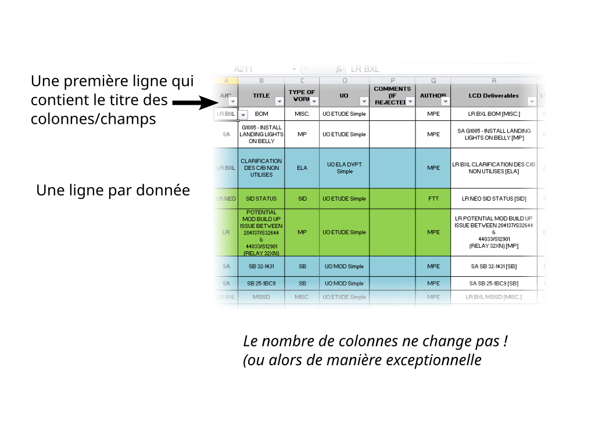

# Introduction au concept de bases de données

## Durée 
?

## Objectifs
- [ ] Utiliser Excel comme un SGBD
	- [ ] différence colonnes/lignes
	- [ ] pas de mise en page
	- [ ] schema de données
	- [ ] rendu formatté : tableau croisé dynamique
- [ ] CSV, un format d'échange
- [ ] ogr2ogr et VRT, présentation rapide
- [ ] Premier contact avec un vrai SGBD 
	- [ ] on pousse les données excel dans une BD postgresql (ogr2ogr + vrt, je le fais moi ou je les guide suffisamment)
	- [ ] requêtes SQL (ou comment faire du tableau croisé dynamique sans souris)
	- [ ] insertion


## Tableur : base de données ou pas ?

*Tableur = MS Excel, Libreoffice Calc etc.*

Les puristes vous diront que non, ce n'est pas une base de données. Dans un sens, c'est vrai. En tous cas pas une base de données relationnelles.

... sauf que c'est malgré tout l'outil que la plupart des gens utilisent pour inventorier, organiser et stocker leurs données. Et les éditer.

Alors ça vaut le coup d'en parler
- pour mieux intégrer ces pratiques dans un usage de base de données. Notamment structurer proprement les données dans les feuilles de votre tableur
- avoir connaissance de méthodes permettant de laisser les gens travailler sur leur tableur, pour un usage final en base de données
- essayer de mettre en place un flux performant qui sortira le moins possible vos collègues de leurs habitudes de travail. Tout en les aidant à mieux se servir de leurs outils.

### Ne pas faire...

**A _ne pas_ faire : **
- **fusion de cellules** : **_à éviter absolument_**, pour un usage de type BD. On en a tous fait, et c'est OK d'en faire quand il s'agit d'un petit tableau, destiné à aller dans un rapport, des slides ou autre. Mais pour stocker de la *donnée*, c'est une très mauvaise idée : 
	- On ne peut plus faire de tri
	- On ne peut plus faire de filtre
	- On ne peut plus faire de tableau croisé dynamique
	- On ne peut plus faire de formule
	- On ne peut plus faire de macro
	- Parce que ça va énerver celui qui récupérera votre travail et qu’il ne pourra rien en faire
	- Parce qu’il suffit de 3 clics avec un tableau croisé dynamique pour créer un joli rapport avec des cellules fusionnées automatiques
- **sauts de ligne** : sauter une ligne, c'est pareil, c'est tentant pour aérer et structurer le contenu. Mais c'est pénible à gérer ensuite. Et, par exemple, ça risque de casser le bon fonctionnement d'un tableau croisé dynamique. Mieux vaut jouer sur la couleur, ou bien la hauteur de la ligne
- **Changer de colonne pour un niveau inférieur** : une même donnée doit rester dans la même colonne. On voit régulièrement des tableaux où une indentation permettant de distinguer plusieurs niveaux se fait par la changement de colonne. Inutilisable en mode données.
- **Ajouter une colonne pour chaque nouvelle année/date/thématique**. Comme nos écrans sont plus larges que haut, la tendance la plus intuitive serait de rajouter des *colonnes* plutôt que des *lignes*. C'est vite difficilement utilisable. En principe, le nombre de colonnes ne devrait pas changer dans le temps. C'est les lignes, qui s'incrémentent.

#### Exemples
- 1 colonne par année : https://www.data.gouv.fr/fr/datasets/donnees-de-comptabilite-generale-de-letat/, fichier 2012-2022-balances-des-comptes-de-letat.csv
- joli tableau mais cellules fusionnées (et 1 colonne par année) : https://www.data.gouv.fr/fr/datasets/donnees-de-comptabilite-generale-de-letat/, fichier 2006-2022-bilan-cdr-solde.xlsx 2e feuille
- colonnes répliquées : https://opendata.lillemetropole.fr/explore/dataset/menu-cantine/table/


### Bonnes pratiques

- noms des colonnes dans la première ligne
- données dans les lignes suivantes
- attention au *type* (ou *format*) des données




#### Exemples
- https://opendata.lillemetropole.fr/explore/dataset/wwwroubaixshopping/table/
- 

### Si on veut faire une synthèse des données
- tableau croisé dynamique
- graphique
- à la main avec des fonctions comme `NB.SI.ENV`, `SOMME.SI.ENV` etc

https://documentation.libreoffice.org/assets/Uploads/Documentation/en/CG7.1/CG71-CalcGuide.pdf


## CSV, un format d'échange
*https://en.wikipedia.org/wiki/Comma-separated_values*

On va rarement travailler sur un fichier CSV. Par contre, on va souvent en rencontrer, par exemple sur https://data.gouv.fr.

CSV = *Comma Separated Values*

En pratique, on pourra trouver différents types de séparateurs. En France, ça sera souvent le `;`. 

Il existe aussi une variante, moins courante, le TSV (tabulation)

CSV est un format *texte*. C'est à dire que vous pouvez l'afficher facilement avec n'importe quel outil. Un exemple simple : `head monfichier.csv` permet de voir la structure et un aperçu du contenu du fichier CSV, rapidement même si celui-ci est énorme, dans votre console. Si on parle d'une donnée de plusieurs millions de lignes, la charger dans votre tableur sera une autre affaire.
A comparer avec un format xlsx ou ods, qui ne pourra pas se visualiser facilement hors d'un tableur. Ou s'éditer.

Tout logiciel et tableur sera capable de lire du CSV (et permet de configurer les paramètres d'import, comme le séparateur). Il permettra aussi d'exporter en CSV. C'est donc un format d'échange bien pratique.

Son principal inconvénient : il ne stocke pas les types des colonnes (Texte, Entier, Date etc).Il existe bien quelques essais pour corriger ce souci ([fichier CSVT (QGIS, GDAL/OGR)](https://docs.qgis.org/2.18/fr/docs/user_manual/managing_data_source/supported_data.html#csvt-files), [Tabular data package](https://specs.frictionlessdata.io/tabular-data-package/#introduction), [type prefixes](https://www.webdatarocks.com/doc/data-type-prefixes/)). Mais l'adoption est encore assez limitée.

Dans un usage geospatial avec QGIS et GDAL/OGR, on pourra s'intéresser 
- aux fichiers .csvt, voire au [GeoCSV](https://giswiki.hsr.ch/GeoCSV)
- ou bien au format VRT, qui a l'avantage de couvrir bien plus que le simple format CSV

## VRT ? GDAL/OGR ?
*https://gdal.org/*

GDAL/OGR est un projet open source, qui fournit :
- une librairie logicielle (brique à assembler dans un programme) d'entrée/sortie pour de nombreux formats. En clair, elle permet de lire et d'écrire de très nombreux formats. La plupart sont goepspatiaux. Certains sont plus génériques, comme par exemple CSV, XSL(X), ODS.
La liste est fournie sur leur site : [formats vecteur](https://gdal.org/drivers/vector/index.html), [formats raster](https://gdal.org/drivers/raster/index.html)
- un ensemble de programmes et de scripts permettant de manipuler les données supportées.

La librairie GDAL/OGR est utilisée un peu partout dans l'univers des SIG, et pas que dans l'open source. Sa licence assez souple (MIT) permet son utilisation dans des projets propriétaires. Elle est par exemple utilisée, à ma connaissance, dans ArcGIS Desktop et FME. Pas mal, non ?

**GDAL** concerne les données raster (images)

**OGR** concerne les données vecteur (géométries vectorielles, données tabulaires)

Nous allons donc plutôt ici regarder du côté d'OGR

### VRT
*https://gdal.org/drivers/vector/vrt.html#vector-vrt* 

J'ai découvert le format VRT récemment, lors du Geocom 2021 (conférence de la communauté geOrchestra). Le seul à s'être tenu en ligne et donc... à être enregistré ([vidéo sur youtube](https://www.youtube.com/watch?v=EIYF6JhlmAY)).

VRT est un format supporté (et inventé et maintenu) par la librairie OGR. Son rôle est de définir une donnée virtuelle, grâce à un fichier XML définissant des correspondances et traitements, et bien sûr une donnée source. On parlera de donnée VRT en parlant du fichier `.vrt`.

Exemple de contenu de fichier VRT : 
```xml
<?xml version="1.0" encoding="UTF-8"?>
<OGRVRTDataSource>
  <OGRVRTLayer name="locations">
    <SrcDataSource relativeToVRT="1" shared="1">locations.csv</SrcDataSource>
    <SrcLayer>locations</SrcLayer>
    <Field name="city" type="String" src="CITY"/>
    <Field name="number" type="Integer" src="NUMBER"/>
    <Field name="year" type="Integer" src="YEAR"/>
    <GeometryType>wkbPoint</GeometryType>
    <LayerSRS>WGS84</LayerSRS>
    <GeometryField encoding="PointFromColumns" x="LON" y="LAT"/>
  </OGRVRTLayer>
</OGRVRTDataSource>
```

Comme on le voit dans cet exemple, le format VRT permet non seulement de définir le type de chaque champ, mais aussi de le renommer, utiliser des colonnes pour générer un champ géométrique, etc.

Je n'en dirai pas plus. Les patients attendront le cours sur le format VRT. Les curieux iront voir [la doc fournie par OGR](https://gdal.org/drivers/vector/vrt.html#vector-vrt).

### OGR

La librairie OGR permet de manipuler des données vectorielles, et notamment des données VRT. 
Elle fournit aussi des utilitaires en ligne de commande, notamment : 
- [ogrinfo](https://gdal.org/programs/ogrinfo.html#ogrinfo) : afficher les propriétés d'une donnée vectorielle.
- [ogr2ogr](https://gdal.org/programs/ogr2ogr.html#ogr2ogr) : conversion d'un format à un autre. Mais en fait, bien plus que ça. Avec ses nombreuses options, et si on tient compte que parmi les formats de sortie possibles, il y a les bases de données, c'est un excellent outil de publication en base de données.

### VRT + ogr2ogr = ETL ?

Combinés ensemble, VRT et ogr2ogr constituent en fait quasiment un [ETL](https://fr.wikipedia.org/wiki/Extract-transform-load) (Extract Transform Load) léger permettant de lire, transformer, filtrer et publier des données. Le tout en ligne de commande, donc facilement automatisable dans un environnement serveur. Et... gratuit et libre d'utilisation !

### Le tableau comme outil de saisie de base de données
Quel rapport avec notre sujet ?

Hé bien VRT est capable de lire et transformer des données CSV. Et même du XSLX ou ODS. ogr2ogr sait publier en base de données. On a donc tout le nécessaire ou presque pour alimenter une base de données solide (type PostgreSQL, MySQL ou Oracle) en ligne, à partir de fichiers tableur gérés par des personnes non-techniques, non formées aux bases de données.

En d'autres termes : on peut 
- laisser les collègues travailler sur leurs outils habituels, 
  - sans leur demander d'apprendre les bases de données, la ligne de commande, les SIG etc. 
  - avec peut-être juste quelques préconisations sur la façon d'organiser leurs données dans leurs tableurs
- leur permettre ainsi d'alimenter nos bases de données à vocation SIG (ou pas d'ailleurs)
- et nous, on se focalise sur notre part : 
  - mettre en place le flux de publication (écrire le VRT, éventuellement automatiser la publication)
  - exploiter les données une fois en base, notamment via des vues, jointures et autre pratiques amusantes.

## Bases de données
Je ne vais pas m'étaler sur la théorie, les modèles conceptuels de données etc. Vous aurez des cours sur les bases de données durant le cursus.

On va regarder la base de données dans la continuité de ce cours : un système de gestion de bases de données (SGBD), PostgreSQL par exemple, fait à peu près la même chose qu'un tableur, avec notamment les différences suivantes : 
- beaucoup plus performant. Il est capable de gérer plusieurs millions d'enregistrements sans broncher
- usage distribué : habituellement, on les héberge sur un serveur, en ligne, pour des accès multiples
- sécurisé : du fait du point précédent, la sécurité importe beaucoup
- relationnel : souvent, les tables sont reliées entre elles, avec des relations de dépendances, de contraintes d'unicité etc.
- langage SQL : les interactions se font via un langage puissant et standardisé, le SQL (enfin, pas toujours, il existe des BD qualifiées de "noSQL")

Pour cette initiation, on va regarder du côté de PostgreSQL/PostGIS. PostGIS est l'extension spatiale qui permet à PostgreSQL de gérer efficacement les données à caractère géospatial. 

Il existe des outils graphiques pour exploiter une base PostgreSQL. Mais pour cette mise en jambes, on est déjà sur la console alors restons-y. Il est également important de savoir se passer de l'interface graphique : vous n'y aurez pas toujours accès !

### Se connecter à une base de données
1. installons le client ligne de commande pour postgresql : `sudo apt install postgresql-client`
2. il faut récupérer les paramètres de connexion de la base cible : 
  - hôte (nom ou IP de la machine cible)
  - port (par défaut c'est 5432)
  - nom de la base
  - nom d'utilisateur
  - mot de passe
<br />En principe, idgeo nous fournit une base, sinon j'en mettrai une en place pour la durée de ce cours
```bash
# note pour moi-même : si pas de base, en lancer une via la compo docker
docker compose -p idgeo-db -f resources/docker-compose.yml up -d
```
3. on utilise le client, psql, pour se connecter : 
```bash
psql -h my_host -p 5432 -U my_user -d my_base
```
Si la connexion se passe bien, on aura une invite de commande. On peut demander l'aide via `\?`. Et il est facile de trouver une liste des commandes les plus utiles. Par exemple sur https://www.postgresqltutorial.com/postgresql-administration/psql-commands/.

### Pousser de la donnée en base
A priori, notre base est vide pour l'instant. On ne va pas rentrer trop dans le détail de l'ingestion de données. Mais puisqu'on a parlé d'un flux de publication, on va voir le cas simple où l'on publie des données CSV ou xlsx en base. On va utiliser ogr2ogr : 

TODO: Collecter les jeux de données à utiliser et les préparer
```bash
# Afin d'éviter devoir taper le mot de passe à chaque fois, on va le déclarer en variable d'environnement ici : 
export PGPASSWORD=secret  # Remplacer par le vrai mdp bien sûr
# Et pour simplifier les paramètres de connexion, on peut faire pareil avec le reste : 
export PGDATABASE=cpgeom
export PGUSER=cpgeom
export PGHOST=localhost

prefix=jpommier
source=ouvrages-acquis-par-les-mediatheques
# On remplace le préfixe par défaut dans les VRT. Il permet qu'on ait chacun nos tables 
# dans la base sanss'écraser les uns les autres
sed -i "s/jpommier/$prefix/g" ${source}.vrt
ogr2ogr -progress -f PostgreSQL PG:"host='$PGHOST' user='$PGUSER' dbname='$PGDATABASE'" ${source}.vrt -lco OVERWRITE=YES
# Et si ça s'est bien passé, on envoie le reste avec une boucle, c'est plus efficace : 
for source in 2012-2022-balances-des-comptes-de-letat donnees-essentielles-mel-marches-publics logements-vacants-du-parc-prive-par-commune-au-01012021-lovac admin_express_communes_31  menu-cantine
do
  sed -i "s/jpommier/$prefix/g" ${source}.vrt
  ogr2ogr -progress -f PostgreSQL PG:"host='$PGHOST' user='$PGUSER' dbname='$PGDATABASE'" ${source}.vrt -lco OVERWRITE=YES 
done
```
Pour alléger la ligne de commande, on a utilisé des variables d'environnement pour déclarer les paramètres de connexion. Je ne les ai pas nommées au hasard. Pour que psql et ogr les reconnaissent, il faut suivre une convention. Cf. https://docs.postgresql.fr/15/libpq-envars.html.

On aurait aussi pu écrire un fichier .pgpass comme documenté dans https://docs.postgresql.fr/10/libpq-pgpass.html.

### Requêtes SQL (ou comment faire du tableau croisé dynamique sans souris -- et sans soucis)
Commençons par vérifier que les données sont bien présentes dans la base : on va utiliser psql pour exécuter une seule commande : 
```bash
psql -c "\dt public.*;"
```
Ca devrait nous lister les tables publiées dans le schema public, qui est le schema par défaut.

Si c'est bon, on peut ouvrir une console psql pour faire nos manips, ça sera plus pratique : 
```bash
psql # normalement pas besoin de plus car on a défini les variables d'environnement PGTRUC préalablement dans cette console.
```

**_A partir de maintenant, on est dans la ligne de commande interactive de psql_**
```sql

```
TODO:

### Insertion de données

TODO:
